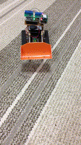

## Description
BTBulldozer is a toy bulludozer that is controlled by Bluetooth. Bulldozer is based on TAMIYA No.107 and each motor is controlled by a micro controller.

The micro controller is Feather M0, that supports CircuitPython. With CircuitPython, you do not need to prepare any environment for the micro controller. When you connect Feather M0 to your computer, the device is detected as a mass storage drive. After that, just putting Python code will kick launching.

The controller is designed for Android and Windows UWP with Xamarin. iOS is not supported because classic Bluetooth requires MFi device and protocol.

## Parts
+ Bulldozer: [TAMIYA No.107](http://www.tamiya.com/japan/products/70107/index.html)
+ Micro controller: [Adafruit Feather M0 Express](https://www.adafruit.com/product/3403)
+ Bluetooth module: [RN-42](http://akizukidenshi.com/catalog/g/gM-08690/)
+ Motor driver: [TB6612](http://akizukidenshi.com/catalog/g/gK-11219/)

## Directories
+ feather: includes CircuitPython code for Feather M0
+ apps: includes Xamarin project

## Sample

